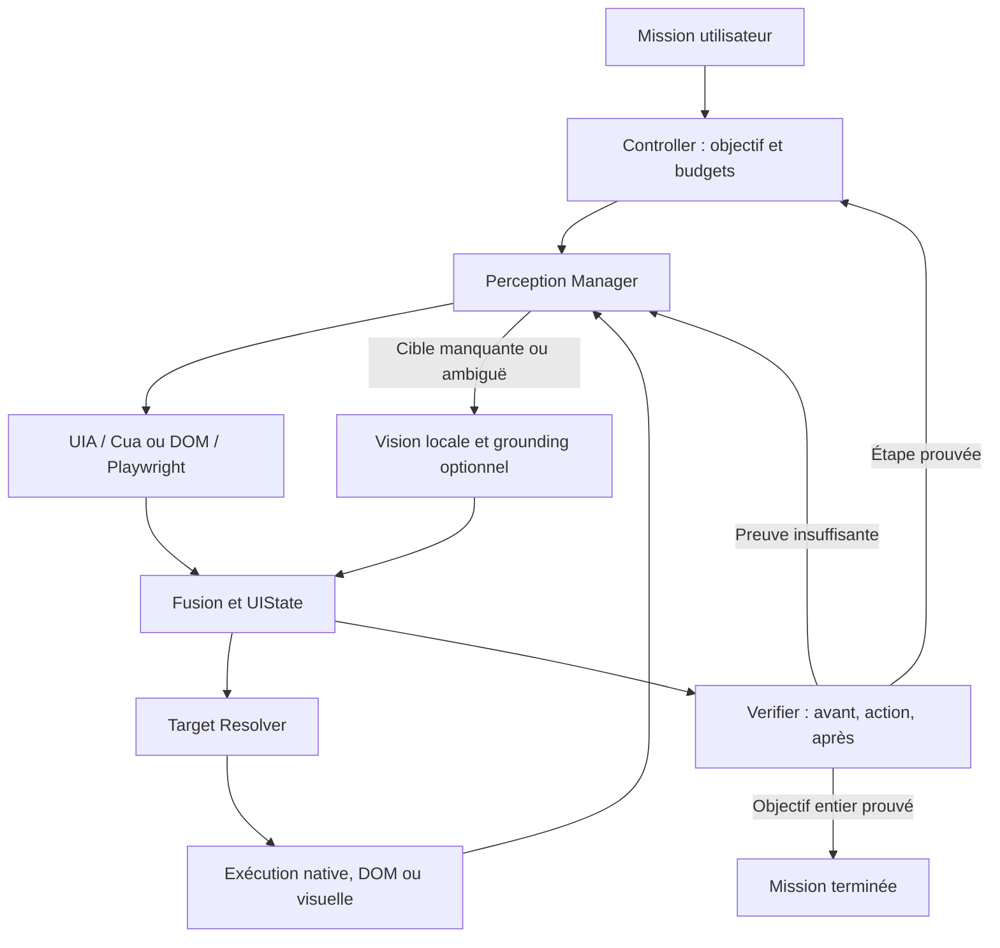

# Computer Use Engine V2 — intégration et validation

Cette branche ajoute un moteur générique expérimental autour des primitives existantes. Elle ne contient aucun chemin spécial pour WhatsApp, aucun raccourci choisi selon le nom d'une application, et aucune collection de scripts de sites. Le planner reste Cerebras ; la perception, le grounding, l'exécution et la preuve ont des contrats séparés.

Base de développement : `feature/visual-perception-fallback-v1`, commit `e83558ce4f68debf1622009f5aa85e90c6e156d3`. Checkpoint historique : `038740e412715c8d50d044090124a71cf3e5bbf1`. Branche d'intégration : `feature/computer-use-fusion-v2`. Les deux premières références ne sont pas déplacées.

## Ce qui est réellement implémenté

- Observation unifiée avec scope fenêtre/processus ou page/document, identifiant, temps, génération, entités, valeurs, régions, provenance, couverture et incertitudes.
- Perception ciblée : structure en premier ; vision si le contrôle utile manque, même dans un arbre globalement exploitable, ou si UIA échoue. UIA conserve son fallback Cua existant. Une session CDP explicitement configurée utilise DOM/Playwright et consulte AX.
- Fusion conservative : un contrôle UIA/DOM unique enrichi par les pixels garde sa ref native et son exécuteur. Une autre fenêtre, un PID différent, une nouvelle génération de document ou une géométrie incompatible ne sont pas fusionnés.
- Résolution générique `ref` ou `role/label/region/within`, avec refus d'une cible ambiguë, désactivée, périmée ou insuffisamment étayée. Les refs restent opaques.
- Objectif composé figé avant les mutations, postconditions typées pour chaque étape, comparaison avant/action/après et preuve de l'objectif final.
- Réobservation automatique après mutation. Les relectures natives exactes d'une écriture simple restent prioritaires et évitent une capture/VLM supplémentaire.
- Budgets, détection d'inspections sans information nouvelle, actions répétées sans effet, annulation et continuation bornée lorsque le planner s'arrête avant son objectif.
- Journal de décisions, observations, transitions et preuves dans les fondations existantes. `AgentTurnResult` porte `goal_completed`, `mission_status` et `verification`. La voix, le texte et le miroir Kernel Shadow conservent ce verdict.

Il s'agit d'une première intégration du moteur et de son protocole de preuve. Les tests ne démontrent pas encore une maîtrise universelle des applications Windows ni la précision d'un modèle de vision sur la machine de l'utilisateur.

Les objectifs composés de cette version sont vérifiés dans une même surface, avec les navigations explicitement reconnues du même onglet. Une mission traversant plusieurs applications nécessite l'extension suivante : prédicats scoped par surface et preuves indépendantes pour chaque surface. Le moteur ne contourne pas cette limite en acceptant une observation d'une autre fenêtre comme preuve.

## Architecture exécutée



Le controller appelle les primitives existantes plutôt que de créer un deuxième driver ou un deuxième Kernel. `UIState` est un état perceptuel local à l'exécution ; `MissionContextStore` conserve les checkpoints si le tracing est activé. Les commandes restent séquentielles, avec une seule mutation en cours.

## Fichiers et responsabilités

| Composant | Responsabilité concrète |
|---|---|
| `ui_observation.py` | Contrats de scope, entité, observation, provenance et empreinte sémantique |
| `ui_geometry.py` | Transformation boîte normalisée → crop → coordonnées physiques/CSS ; origine négative et domaines 999/1000 explicites |
| `semantic_grounding.py` | Ontologie générique, extraction des faits structurés/visuels, fusion sans remplacer les refs fiables |
| `perception_router.py` | Escalade selon la cible, fusion et nouvelle observation de l'état |
| `target_resolver.py` | Identification unique, scope, fraîcheur et éligibilité de l'action |
| `ui_verifier.py` | Postconditions typées ; `passed`, `failed`, `inconclusive`, `unsafe` et IDs des preuves |
| `ui_state.py` | Transitions, historique borné, détection de répétition et d'absence d'effet |
| `computer_use_controller.py` | Objectif figé, outils génériques, exécution, réobservation, budgets et checkpoint |
| `computer_use_runtime.py` | Garde de complétion commune aux providers ; reprise bornée ; acknowledgements sans mutation |
| `browser_adapter.py` | Adapter Playwright/CDP optionnel, worker dédié, refs de nœuds et de documents |
| `vision_providers.py` | Contrat remplaçable ; provider Ollama local ; schémas et validation stricte du grounding |
| `screen_vision.py` | Capture/crop, interprétation locale, grounding ciblé, vérification géométrie/pixels/focus et clipboard Unicode |
| `windows_perception.py` | Chemins UIA/Cua conservés ; HWND/PID/process-start, valeurs vides et focus/selection ; fermeture exacte conservée |
| `native_tools.py`, `agent_runtime.py` | Branchement opt-in, outils au planner, postconditions en attente, feedback JSON valide |
| `tracing_runtime.py`, `event_journal.py`, `kernel_contracts.py` | Événements observables et complétion fondée sur le verdict explicite |
| `assistant_v3.py`, `shadow_kernel_runtime.py`, `capability_registry.py` | Voix/texte, arrêt, affichage de mission non vérifiée et miroir des résultats sans fausse complétion |
| `benchmarks/unknown_ui.py` | Interface locale nouvelle, plusieurs layouts et mode canvas opaque ; oracle séparé des outils du planner |

`cua_driver_bridge.py` et `ui.py` n'ont pas besoin d'une réécriture pour cette intégration. Les refs et la session persistante du driver sont conservées. L'interface Qt reçoit le verdict par le worker commun.

## Préserver le mode fiable

Par défaut, `JARVIS_COMPUTER_USE_ENABLED=0`. `JARVIS_COMPATIBILITY_BASELINE=1` désactive toujours le nouveau moteur, même si son flag est accidentellement à 1. Les anciens lanceurs restent disponibles.

Cas à préserver : Bloc-notes → contrôle `Document` writable → `write_ui_element` → relecture exacte et `verified=true`. `act_ui` sur ce même contrôle délègue également à `write_ui_element`. Si la preuve native correspond exactement à la postcondition, elle suffit pour cette écriture. Les étapes suivantes doivent néanmoins récupérer de nouvelles refs.

La vision ne devient pas prioritaire parce qu'elle est activée. Un nom sémantique ajouté par vision ne fait pas perdre le contrôle structuré. Une valeur tronquée n'est jamais traitée comme la valeur entière pour prouver une égalité.

La modification intentionnelle de preuve : une inspection quelconque après un clic ne suffit plus pour l'apprentissage d'un succès. Le test historique qui acceptait cette déduction a été corrigé. Les actions UIA fiables elles-mêmes restent couvertes par leur régression.

## Protocole des outils

1. `observe_ui` : sélectionner la bonne fenêtre ou `page_ref`, éventuellement demander une cible, un focus ou un crop.
2. `define_ui_goal` : enregistrer **tous** les résultats observables de la mission, sur un état initial frais. Une ouverture d'application peut précéder cette définition ; une mutation du contenu ne peut pas servir à affaiblir l'objectif après coup.
3. `act_ui` : une opération `click`, `write`, `scroll` ou `key`, une cible observée et la liste `expected` des postconditions de cette étape.
4. Lire la réobservation et `ui_verification`. Rassembler une preuve différente si elle manque ; replanifier si l'effet observé contredit le résultat attendu.
5. `verify_ui_goal` : vérifier l'objectif entier. Une fois prouvé, une nouvelle mutation de cette mission est refusée.

Exemple générique d'écriture, après définition de l'objectif :

```json
{
  "operation": "write",
  "target": {"role": "search_input", "within": "surface:identifiant_observé"},
  "text": "Salah",
  "expected": [{"kind": "value_equals", "role": "search_input", "value": "Salah"}]
}
```

La valeur de `within` ou une ref doit être copiée depuis la véritable observation, pas depuis cet exemple. Le moteur choisit UIA, Cua, DOM ou une boîte visuelle. Les coordonnées ne constituent pas l'intention principale de l'action.

Les rôles génériques incluent recherche, rédaction, résultat de liste/contact, titre du contenu, bouton d'envoi, navigation, email, mot de passe, contenu et message. Les signaux structurés utilisent rôle/label/capacité/valeur ; le VLM ajoute texte, layout et rôles absents. Le vocabulaire est extensible, pas un schéma d'application particulier.

Le premier objectif vient du planner et doit correspondre à la demande humaine. Le moteur peut empêcher de l'affaiblir et exiger les types de preuve nécessaires ; il ne garantit pas à lui seul la traduction parfaite de toute mission en prédicats.

## Preuve et sécurité des reprises

`success=true` d'une action signifie qu'elle a été délivrée. `verified=true` signifie que ses postconditions ont été démontrées. `goal_completed=true` signifie que tous les prédicats figés de la mission sont vérifiés et qu'aucune action incertaine ne reste en attente.

Pour un envoi, le moteur demande un `new_text` dans une région de messages ou avec `role=message`, ainsi qu'une preuve de contexte/destinataire. Il vérifie le contexte avant de délivrer l'envoi. Une commande Entrée dans un rédacteur est soumise à la même règle. Un champ vidé ou un texte déjà visible avant l'action ne prouvent pas un nouveau message. Un envoi non confirmé n'est pas répété automatiquement.

La preuve d'un message visible correspond à un objectif UI ; elle ne prouve pas une réception distante ni un accusé serveur que l'interface ne montre pas. Utiliser un texte de test unique et inspecter les statuts affichés lorsqu'une mission exige davantage.

L'absence dans un arbre sélectionné/incomplet reste `inconclusive`. Préférer une preuve positive du nouvel état, ou une primitive native comme `close_window` qui vérifie l'absence du HWND dans la liste des fenêtres. La simple disparition d'une cible d'un snapshot ne suffit pas.

Les répétitions sont repérées sur le contenu sémantique, pas sur les nouveaux IDs. Une région ou une cible différente constitue une autre stratégie ; répéter la même inspection sans information nouvelle retourne `NO_NEW_EVIDENCE`. Une postcondition non résolue bloque les mutations suivantes. Les budgets par défaut sont 24 actions, 36 observations et 240 secondes ; une continuation automatique ne les remet pas à zéro. L'utilisateur peut explicitement demander une reprise, qui garde objectif, preuve en attente et compteurs de stagnation. Aucune ref persistée n'est réactivée après redémarrage.

## Stratégie par interface

| Interface | Chemin à utiliser |
|---|---|
| Windows native bien exposée | UIA/pywinauto et patterns exacts ; Cua si le fallback structuré existant apporte du contenu |
| Electron | UIA/Cua d'abord ; DOM si une session Chromium/CDP est explicitement disponible ; vision autrement |
| Navigateur avec session CDP configurée | DOM, locators Playwright et actionability ; AX consulté ; vision pour canvas, contrôles non exposés ou ambiguïté visuelle |
| WebView2 | UIA/Cua ; adapter DOM seulement si le produit expose un endpoint autorisé ; vision sinon |
| Canvas ou rendu personnalisé | Vue globale locale puis cible/crop, grounding optionnel, boîte liée à la capture, action et nouvelle preuve |
| Remote desktop / vidéo | Pixels, contexte temporel et postconditions visibles ; les coordonnées ne sont utilisables que pour une interface interactive stable |
| Arbre presque vide | Escalade directe vers pixels, sans conclure que les contrôles visibles n'existent pas |

La présence supposée d'Electron, Chromium ou WebView2 n'autorise aucune recherche de port/profil ni aucun redémarrage de l'application avec des flags. L'adapter s'attache seulement à l'endpoint configuré. Une session navigateur reste ouverte lorsque l'adapter se déconnecte.

Les snapshots DOM couvrent contrôles, labels, cadres, Shadow DOM ouvert, valeurs, focus et sélection. Les refs vérifient document et identité réelle du nœud, y compris lorsqu'un rerender conserve le même label. AX est récupéré pour diagnostic/contexte ; une correspondance exhaustive AX/backendDOMNodeId n'est pas encore implémentée. Ce n'est pas une fusion complète de tous les nœuds AX, DOM et pixels.

## Vision et coordonnées

Les boîtes déclarent leur domaine. Le chemin Ollama actuel demande explicitement `0..1000` relatif à l'image capturée. `CaptureGeometry` sait traiter 999 si un adapter le déclare ; il n'infère pas silencieusement le domaine d'un modèle. Un modèle GUI spécialisé avec un autre protocole nécessite un adapter/conversion explicite.

Windows conserve les bornes physiques et l'origine multi-moniteur, le crop original, le HWND/PID/process-start et un petit cache borné de frames. Avant une action, identité, bornes, âge et pixels de la cible sont recontrôlés. Un déplacement/redimensionnement/layout changé impose une nouvelle observation. La garde de pixels utilise une différence moyenne tolérée ; elle réduit le risque mais ne garantit pas la stabilité de toute animation ou superposition.

Le navigateur utilise des coordonnées de viewport CSS et des captures `scale=css`, y compris à DPR=2. Un crop garde son offset dans ce viewport. Les actions DOM utilisent les contrôles d'actionability Playwright. Une écriture visuelle exige un focus éditable prouvé après le clic ; sur Windows opaque, une nouvelle preuve de caret/focus visible est exigée avant le paste Unicode. Un VLM incapable de cette preuve provoque un arrêt sûr.

`JARVIS_VISION_MODEL` configure la compréhension. `JARVIS_VISION_GROUNDING_MODEL` permet un autre modèle Ollama local pour la localisation ciblée. `JARVIS_VISION_GROUNDING_ENABLED=1` exécute les deux étapes sur la **même capture**, sans addition artificielle des confidences. Un désaccord rend la cible non résolue. Les confidences déclarées restent non calibrées, pas des probabilités mesurées.

Cette branche ne télécharge aucun poids et ne choisit pas un modèle d'après sa popularité. Le modèle local déjà configuré reste utilisable ; le choix final et les mesures qualité/latence/VRAM doivent suivre le benchmark sur le matériel réel. Aucun score OSWorld ni résultat d'un paper n'est attribué à ce moteur sans exécution du protocole correspondant.

## Lancer sous Windows

Dans le checkout de la nouvelle branche, avec les dépendances habituelles et la clé Cerebras déjà dans `.env` :

```powershell
python -m pip install -r requirements.txt
.\scripts\run_computer_use_validation.ps1
.\scripts\run_jarvis_computer_use.ps1 -StructuredOnly
```

Puis perception visuelle et actions visuelles, en utilisant un modèle local installé :

```powershell
.\scripts\run_jarvis_computer_use.ps1 -EnableVisualActions
# Optionnel : compréhension et localisation distinctes, après validation du modèle
.\scripts\run_jarvis_computer_use.ps1 -EnableVisualActions -EnableGrounding -GroundingModel "modele-local-compatible"
```

Le lanceur restaure ses variables d'environnement à la sortie afin de ne pas altérer le prochain lancement historique. Les screenshots restent en mémoire par défaut. Le tracing stocke des textes observés et des arguments d'action localement ; ne partager un log de test réel qu'après avoir retiré les données privées.

Pour une session CDP que vous avez explicitement ouverte :

```powershell
python -m pip install -r requirements-browser.txt
.\scripts\run_jarvis_computer_use.ps1 -CdpUrl "http://127.0.0.1:9222" -EnableVisualActions
```

L'adapter ne lance pas Chrome et n'active pas CDP dans un navigateur personnel. Pour le benchmark, utiliser un profil temporaire séparé et sans compte réel.

## Tests automatisés et inconnus

```powershell
# Régressions, engine, Kernel et voix/texte
.\scripts\run_computer_use_validation.ps1
# Adapter sur Chromium neuf, fixture et oracle local
python -m pip install -r requirements-browser.txt
python -m playwright install chromium
.\scripts\run_computer_use_validation.ps1 -IncludeBrowser
```

Les tests du moteur couvrent notamment fusion conservant UIA, mauvaise fenêtre, PID réutilisé, crop, origine négative, boîtes/JSON invalides, ambiguïté, générations/refs périmées, valeur tronquée, manque de preuve, nouveau texte scoped, budgets, répétitions, gel de l'objectif, annulation, acknowledgements, tracing, Kernel Shadow et boucle commune Cerebras. Douze ordres de layout sont utilisés avec un faux capteur déterministe ; cela teste l'orchestration, pas la vision réelle.

Les tests Chromium utilisent un navigateur et une fixture neufs : DOM inconnu, Unicode, contenteditable, Shadow DOM ouvert, remplacement externe d'un nœud de même label, navigation, crop, DPR=2, mission multi-étapes et envoi local dont l'oracle contrôle indépendamment contact, message et nombre d'envois. Le planner ne reçoit pas l'oracle.

Pour exposer une nouvelle interface sans apprentissage ni recette applicative :

```powershell
python -m benchmarks.unknown_ui --seed 913
# Autre terminal, autre variante, contrôles dessinés en canvas
python -m benchmarks.unknown_ui --seed 927 --opaque --port 8768
```

Ne donner à Jarvis que la mission humaine et la fenêtre/page ouverte. Garder les seeds de validation séparés des seeds de développement. Ne lui transmettre ni le code, ni les rectangles, ni `fixtureState()`. Le mode opaque dessine ses contrôles ; il doit déclencher l'escalade perceptuelle. Aucun envoi externe n'est effectué par cette fixture.

| Scénario réel | Perception attendue | Action et preuve attendues | Échec à signaler |
|---|---|---|---|
| Bloc-notes, texte Unicode unique | Document writable UIA ; aucune vision | Écriture native puis relecture exacte | Substitution visuelle ou texte altéré |
| WhatsApp, chercher puis ouvrir un contact | Structure utile ou escalade si cible absente | Valeur de recherche, résultat unique, titre de conversation et rédacteur observés | Coordonnées/raccourcis codés pour WhatsApp ; titre ambigu |
| WhatsApp, envoi de test explicitement demandé | Destinataire et région messages prouvés | Nouveau texte unique visible après l'envoi ; aucun renvoi incertain | Champ vide utilisé comme seule preuve |
| Chromium, formulaire/site nouveau | DOM/labels/capacités, puis pixels seulement si nécessaires | Valeurs exactes et état suivant positif | Mauvais onglet/document ou simple clic annoncé comme succès |
| Canvas opaque, seed tenu secret | Vue globale puis cible/crop | Boîte fraîche, focus pour écriture, état après action | Capteur répété sans nouvelle preuve |
| Fenêtre déplacée/redimensionnée | Géométrie précédente rejetée | Réobservation et nouvelle résolution | Action sur l'ancien rectangle |
| Ref après scroll/navigation | Ancienne ref rejetée | Nouvelle ref ou intention sémantique réacquise | Réutilisation d'un token périmé |
| « Très bien » après une mission | Aucun capteur/outil/planner | Réponse conversationnelle seulement | Mutation supplémentaire |
| Mauvaise fenêtre ou onglet | Identité incompatible | Refus sans mutation puis sélection explicite | Preuve prise dans une autre surface |

WhatsApp sert de benchmark opaque, pas de nom de classe ni de condition dans le moteur. Pour les vrais envois, utiliser uniquement une conversation de test autorisée et un texte unique. Les contrôles visibles sont découverts à chaque run.

## Limites et étapes suivantes

1. Valider les chemins Windows réels sur la machine cible : UIA/Cua, clipboard, DPI par moniteur et capture de fenêtres couvertes/minimisées. Les tests Windows CI de cette branche sont des régressions unitaires, pas un bureau interactif WhatsApp.
2. Mesurer les modèles locaux sur les seeds tenus secrets : rappel des cibles utiles, localisation, erreurs de rôle, focus, exactitude du texte, latence et consommation. Garder des seuils mesurés et comparer les versions exactes des poids, pas seulement leurs noms.
3. Évaluer les verifiers avec un oracle indépendant pour les missions réelles ; ajouter des preuves ciblées et contrôles négatifs lorsque la méthode connaît complètement le domaine inspecté.
4. Élargir l'ontologie et les primitives génériques à partir d'échecs observés : sélection native d'options, relations parent/enfant, dialogs dépendants et sous-régions stables. Ne pas contourner ces manques avec un skill d'application.
5. Étoffer la correspondance AX/CDP/DOM, les différences régionales de pixels et les stratégies d'observation fondées sur un gain d'information mesuré. Le delta actuel est sémantique et conservateur, pas une segmentation exhaustive de toutes les régions changées.
6. Ajouter d'autres providers de vision/grounding derrière le contrat existant seulement après validation des boîtes et de la politique de capture. Cerebras peut rester le planner. Aucune dépendance complète à un agent externe n'est imposée.

## Sources qui motivent les choix

L'intégration est originale et réutilise les dépendances existantes et Playwright, sans importer un framework d'agent complet. Les patterns ont été confrontés aux sources et au code réels lors de l'investigation préalable.

- Microsoft UI Automation : https://learn.microsoft.com/en-us/windows/win32/winauto/uiauto-uiautomationoverview
- Electron accessibility : https://www.electronjs.org/docs/latest/tutorial/accessibility
- Playwright locators/actionability/CDP : https://playwright.dev/python/docs/locators ; https://playwright.dev/python/docs/actionability ; https://playwright.dev/python/docs/api/class-browsertype#browser-type-connect-over-cdp
- CDP AX : https://chromedevtools.github.io/devtools-protocol/tot/Accessibility/
- OpenClaw, targets et cycle des refs : https://github.com/openclaw/openclaw/blob/main/extensions/cua-computer/src/action-targets.ts ; https://github.com/openclaw/openclaw/blob/main/extensions/cua-computer/src/ref-lifecycle.contract.test.ts
- OpenClaw, snapshots/deltas navigateur : https://github.com/openclaw/openclaw/blob/main/extensions/browser/src/browser/pw-role-snapshot.ts ; https://github.com/openclaw/openclaw/blob/main/extensions/browser/src/browser/snapshot-delta-cache.ts
- UFO : https://github.com/microsoft/UFO/blob/main/ufo/agents/processors/strategies/app_agent_processing_strategy.py
- WindowsAgentArena/Navi : https://github.com/microsoft/WindowsAgentArena/blob/main/src/win-arena-container/client/mm_agents/navi/agent.py
- browser-use DOM/CDP : https://github.com/browser-use/browser-use/blob/main/browser_use/dom/service.py ; https://github.com/browser-use/browser-use/blob/main/browser_use/dom/enhanced_snapshot.py
- Agent S3, séparation planner/grounder/exécution : https://github.com/simular-ai/Agent-S/blob/main/gui_agents/s3/agents/grounding.py ; https://github.com/simular-ai/Agent-S/blob/main/gui_agents/s3/agents/worker.py
- GUI-Actor, localisation et verifier : https://github.com/microsoft/GUI-Actor/blob/main/src/gui_actor/inference.py ; https://github.com/microsoft/GUI-Actor/blob/main/verifier/verifier_model.py
- Ollama structured outputs : https://docs.ollama.com/capabilities/structured-outputs
- OSWorld/WebArena, séparation action/objectif et oracle d'évaluation : https://github.com/xlang-ai/OSWorld ; https://github.com/web-arena-x/webarena
